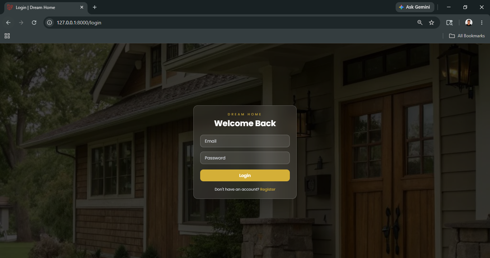
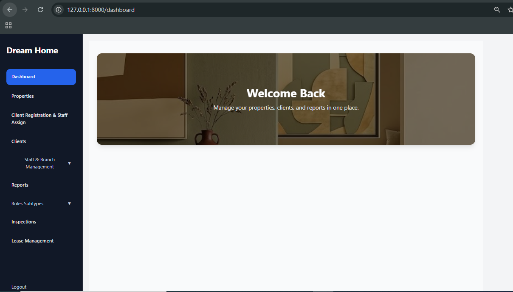
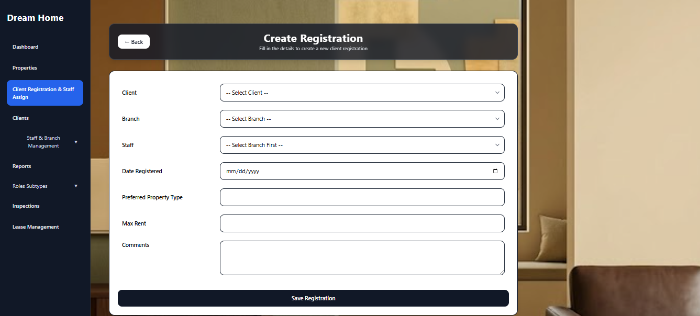
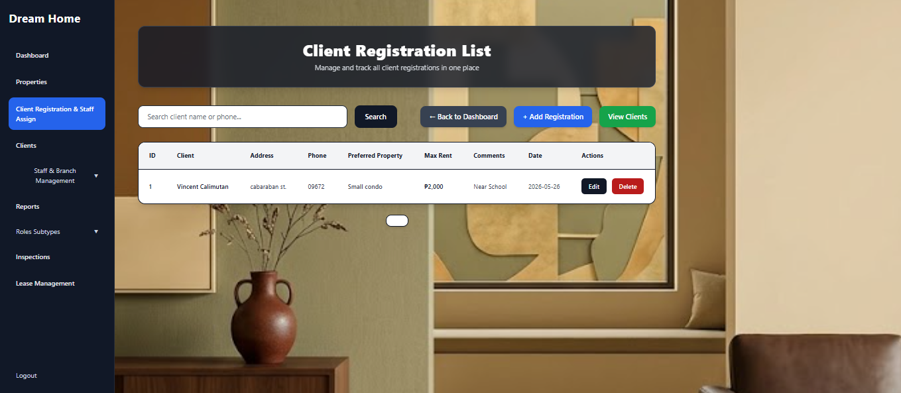
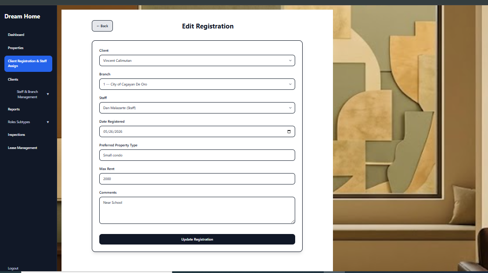

README.md 

# Project Name
-- DREAH HOME --

## Project Description
A project that shows and deploy a Website where clients can avail rental properties through online


## Team Members

| Name		 	| Module |
|----------------------	|--------|
|Jo Nathaniel		| 1	 |
|Vincent S. Calimutan	| 2 	 |
|Angela Denise Ibe 	| 3 	 |
|Aldren O Restauro	| 4 	 |
---

## Tech Stack

- Laravel
- PHP
- PostgreSQL
- Railway
- Bootstrap/Tailwind

---

## Repository Link

https://github.com/angeladeniseibe/websys_pit.git

---

## Setup Instructions

```bash
git clone <repo>

composer install
npm install

cp .env.example .env

php artisan key:generate
```

---

## Environment Variables

Update `.env`

```env
DB_CONNECTION=pgsql
DB_HOST=
DB_PORT=5432
DB_DATABASE=
DB_USERNAME=
DB_PASSWORD=
```

---

## Run Migration and seeders

```bash
php artisan migrate --seed
```

---

## Start Development Server

```bash
npm run dev
php artisan serve
```

---
 

         
## Default Login

Admin Account
email = admin@test.com
password  = 12345678

Manager Account
email = manager@test.com
password  = 12345678

Staff Account
email = staff@test.com
password  = '12345678'

supervisor Account
email = supervisor@test.com
password  =12345678

secretary Account
email = secretary@test.com
password  =12345678

Staff Account
email = staff@test.com
password  =12345678

---

## Database Information

### Database Platform

Railway PostgreSQL

### Main Tables

| Table     	| Purpose 			            |
|-----------	|------------------------------	|                   
| users	    	| authentication 	        	|
| client	    | basic data for client		    |
| registration	|record for client registration	|
| sales     	| transactions	 		        |
| sales     	| transactions 			        |
| sales     	| transactions			        |
| sales     	| transactions 		        	|
---

## Module Assignment

| Module |   Assigned Developer	 |
|--------|---------------------- |
|  1 	 |Jo Nathaniel Lucero 	 |
|  2 	 |Vincent S. Calimutan	 |
|  3 	 | Angela Denise Ibe	 |
|  4   	 |Aldren O. Restauro	 |


---

## Deployment Information

### Live URL

```txt
https://your-project-url.com
```

### Hosting Platform

```txt
Railway
```

---

## Screenshots

Required screenshots:
- Login Page 
- Dashboard 
- CRUD Module
(Client Registration)
Create 
Read and Delete 
Update 


- PostgreSQL Database Tables
